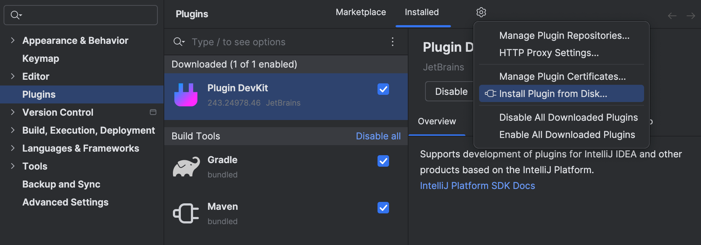

# Big Brother Eye

Plugin for [Big Brother](https://github.com/theburyat/BigBrother) application.

Latest version is available to install from releases.

Steps to start using:

0. Prerequisites:
   * Big Brother web app address
   * IntelliJ Platform IDE (IDEA, Pycharm, WebStorm etc.)
   * SQLite
1. Download last available plugin release
2. Install it to IDE:
    * Open Settings -> Plugins -> Install Plugin from Disk
   
    * Choose downloaded file
    * Save changes
3. 
   * Press `Find everywhere` (double shift on default IntelliJ Keymap) and enter `Start Tracking`
   
   * Insert requested info
    
   * Work with your code
   * Press `Find everywhere` and enter `Finish Tracking`
   
